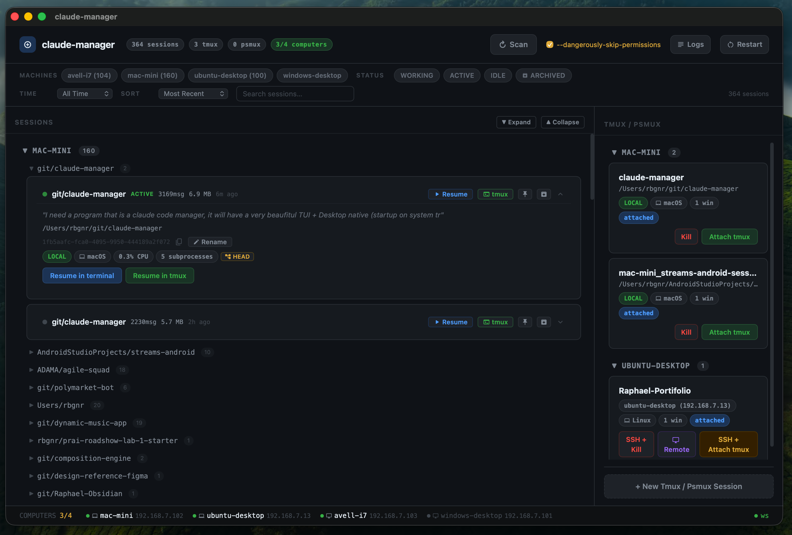

# claude-manager

> Never lose track of a Claude Code session again.



  

**claude-manager** is a fleet session manager that discovers, organizes, and resumes Claude Code sessions across all your machines from a single interface.

## The Problem

You have 5 machines. 300+ Claude Code sessions. Dozens of tmux/psmux multiplexer sessions. You can't remember:

- Which machine has the session for that urgent bug fix?
- What folder were you in when you started that refactoring?
- Is that session still running or did it idle out?
- How do you resume a session on a remote Windows machine from your Mac?

**claude-manager** solves this in one click.

## Features

- **Fleet Session Discovery** — Scans all your machines simultaneously and shows every Claude Code session in one view. Detects Working / Active / Idle status using PID tracking and CPU sampling so you know what's live at a glance.
- **One-Click Resume** — Click any session card to open it in a terminal window (iTerm2, Terminal.app, gnome-terminal, PowerShell — whatever is native to the target OS).
- **tmux & psmux Management** — List, create, attach, and kill tmux sessions (Linux/macOS) and psmux sessions (Windows) across every machine, locally or remotely.
- **Three Interfaces** — Terminal UI (Textual TUI), Web UI (React SPA), and Native Desktop window (pywebview). Pick whichever suits your workflow.
- **API-First** — A REST + WebSocket server drives all three interfaces. Any tool that speaks HTTP can integrate.
- **Fleet Integration** — Primary scanning uses the [claude-dispatch](https://github.com/raphaelbgr/claude-dispatch) daemon API for speed. SSH is the automatic fallback for machines without a daemon.
- **Cross-Platform** — macOS, Linux, and Windows. Handles both Unix tmux and Windows psmux in the same unified view.
- **Live Updates** — WebSocket streaming pushes session and fleet diffs to all connected clients every 30 seconds, no manual refresh needed.
- **Rich Session Cards** — Git branch, message count, file size, first message summary, working directory, CPU usage, child process count, last modified time.
- **Session Organization** — Pin sessions to the top, archive sessions to hide them, rename sessions (equivalent to `/rename` in Claude Code), and group by machine or project folder.
- **Universal Mux Parser** — Single parser handles tmux pipe-delimited format and psmux plain-text output automatically.
- **Filter Bar** — Live text search across session path, summary, status, machine name, sort by time or status.
- **Hardware Monitoring** — CPU, GPU, and RAM stats per machine displayed in fleet view and session cards.
- **Folder Browser** — Integrated folder picker with drive selector (Windows), directory navigation, and mkdir for launching new sessions.

## Quick Start

### macOS

```bash
curl -fsSL https://raw.githubusercontent.com/raphaelbgr/claude-manager/master/installers/install-macos.sh | bash
```

### Linux

```bash
curl -fsSL https://raw.githubusercontent.com/raphaelbgr/claude-manager/master/installers/install-linux.sh | bash
```

### Windows (PowerShell)

```powershell
irm https://raw.githubusercontent.com/raphaelbgr/claude-manager/master/installers/install-windows.ps1 | iex
```

### From Source

```bash
git clone https://github.com/raphaelbgr/claude-manager.git
cd claude-manager
./setup.sh
source .venv/bin/activate
claude-manager
```

## Usage

```bash
# Terminal UI (works everywhere, no browser needed)
claude-manager --tui

# Web UI + API server on localhost:44740
claude-manager --enable-web

# Web UI + API server accessible from other machines on your LAN
claude-manager --enable-web --bind 0.0.0.0

# Native desktop window (pywebview)
claude-manager --enable-gui

# API server only (headless, integrate with your own tools)
claude-manager --api-only
```

After starting with `--enable-web`, open **http://localhost:44740** in your browser. When bound to `0.0.0.0`, the startup banner prints your LAN URL (e.g. `http://192.168.1.10:44740`).

### TUI Keybindings

| Key | Action |
|-----|--------|
| `r` | Force rescan |
| `n` | New tmux session (Tmux tab) |
| `/` | Open filter bar |
| `Esc` | Clear filter / close filter bar |
| `Enter` | Launch session / attach tmux |
| `Tab` | Switch between Sessions / Tmux / Fleet tabs |
| `q` | Quit |

## Architecture

```
┌─────────────────────────────────────────────────────┐
│                   claude-manager                     │
│                                                     │
│  ┌──────────┐  ┌──────────────┐  ┌──────────────┐  │
│  │  TUI     │  │  Web UI      │  │  Desktop GUI │  │
│  │(Textual) │  │ (React SPA)  │  │ (pywebview)  │  │
│  └────┬─────┘  └──────┬───────┘  └──────┬───────┘  │
│       └───────────────┼─────────────────┘           │
│                       │                             │
│          ┌────────────▼────────────┐                │
│          │  REST + WebSocket API   │                │
│          │     (aiohttp :44740)    │                │
│          └────────────┬────────────┘                │
│       ┌───────────────┼───────────────┐             │
│  ┌────▼────┐   ┌──────▼──────┐  ┌────▼────┐        │
│  │ Scanner │   │TmuxManager  │  │  Fleet  │        │
│  └────┬────┘   └──────┬──────┘  └────┬────┘        │
└───────┼───────────────┼───────────────┼─────────────┘
        ▼               ▼               ▼
   Local FS +      tmux/psmux      HTTP /health
   ~/.claude/      local + SSH     (dispatch daemon)
   SSH remote      SSH remote      SSH fallback
```

| Component | Role |
|-----------|------|
| `src/server.py` | aiohttp REST + WebSocket API (port 44740) |
| `src/scanner.py` | Claude session discovery — local `~/.claude/` scan + SSH remote |
| `src/tmux_manager.py` | tmux/psmux listing, creation, kill |
| `src/mux_parser.py` | Universal parser for tmux and psmux output |
| `src/fleet.py` | Fleet health — HTTP ping then SSH fallback |
| `src/launcher.py` | Cross-platform terminal launcher |
| `src/command_adapter.py` | OS-aware command builder (bash/cmd/PowerShell/Git Bash) |
| `src/config.py` | Fleet machine definitions and constants |
| `src/main.py` | CLI entry point and argument parsing |
| `src/tui/` | Textual TUI — 3-tab app (Sessions, Tmux, Fleet) |
| `src/web/index.html` | React SPA (CDN imports, single file, served at `/`) |
| `src/desktop.py` | pywebview native window + optional pystray system tray |

Full architecture docs: [docs/architecture.md](docs/architecture.md)

## Configuration

### Fleet Machines

Edit `src/config.py` to define your machines:

```python
FLEET_MACHINES: dict[str, dict] = {
    "my-server": {
        "ip": "192.168.1.10",       # LAN IP for HTTP probes
        "os": "linux",              # "darwin" | "linux" | "win32"
        "ssh_alias": "my-server",   # SSH config alias
        "mux": "tmux",              # "tmux" | "psmux"
        "dispatch_port": 44730,     # claude-dispatch daemon port, or None
    },
    "my-windows-pc": {
        "ip": "192.168.1.20",
        "os": "win32",
        "ssh_alias": "my-windows-pc",
        "mux": "psmux",
        "dispatch_port": None,      # No daemon — SSH-only fallback
    },
}
```

The local machine is auto-detected by hostname. Remote machines are scanned in parallel.

### Preferences

User preferences are stored in `.claude-manager-prefs.json` (git-ignored) at the project root.

| Key | Type | Default | Description |
|-----|------|---------|-------------|
| `skip_permissions` | bool | `false` | Pass `--dangerously-skip-permissions` when launching sessions |

Update via the Web UI toggle or `POST /api/preferences`.

## API Reference

| Method | Path | Description |
|--------|------|-------------|
| `GET` | `/health` | Server health, machine count, session count, last scan time |
| `GET` | `/api/sessions` | All sessions grouped by machine and project |
| `GET` | `/api/sessions/{machine}` | Sessions for a specific machine |
| `POST` | `/api/sessions/scan` | Force immediate rescan |
| `POST` | `/api/sessions/launch` | Open terminal and resume a session |
| `GET` | `/api/tmux` | All tmux/psmux sessions across fleet |
| `GET` | `/api/tmux/{machine}` | Tmux sessions for a specific machine |
| `POST` | `/api/tmux/create` | Create a new detached tmux session |
| `POST` | `/api/tmux/connect` | Attach to a tmux session in local terminal |
| `POST` | `/api/tmux/connect-remote` | Open terminal on remote machine's display |
| `POST` | `/api/tmux/kill` | Kill a tmux session by name |
| `GET` | `/api/preferences` | Get current preferences |
| `POST` | `/api/preferences` | Update preferences |
| `GET` | `/api/logs` | Recent structured log entries |
| `WS` | `/ws` | WebSocket — subscribe to live session/tmux/fleet updates |

Full request/response docs: [docs/api.md](docs/api.md)

## Integration with claude-dispatch

When a machine has `dispatch_port` set, claude-manager uses the [claude-dispatch](https://github.com/raphaelbgr/claude-dispatch) daemon API for faster scanning:

- **Sessions:** `GET http://<ip>:<port>/sessions`
- **Tmux:** `GET http://<ip>:<port>/tmux`
- **Health:** `GET http://<ip>:<port>/health`

If the daemon is unreachable, claude-manager automatically falls back to a self-contained Python scan script executed over SSH.

## Desktop GUI

The native window mode (`--enable-gui`) uses **pywebview** to render the Web UI in a native OS window (WebKit on macOS, WebView2 on Windows, GTK WebKit on Linux).

On Linux and Windows, an optional **system tray icon** (via `pystray` + `Pillow`) provides:

- Open in browser
- Force scan
- Quit

Install desktop dependencies: `pip install ".[desktop]"`

## Screenshots


## Development

```bash
# Dev server (API + web UI)
python -m src.main --enable-web

# TUI dev
python -m src --tui

# Run tests (588 tests across 12 test files)
pip install pytest pytest-asyncio
pytest
```

See [docs/development.md](docs/development.md) for project structure, how to add fleet machines, and code patterns.

## License

MIT — see [LICENSE](LICENSE).
